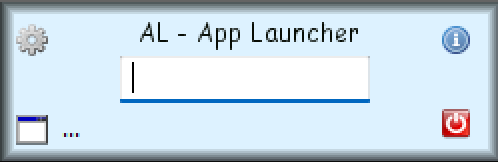
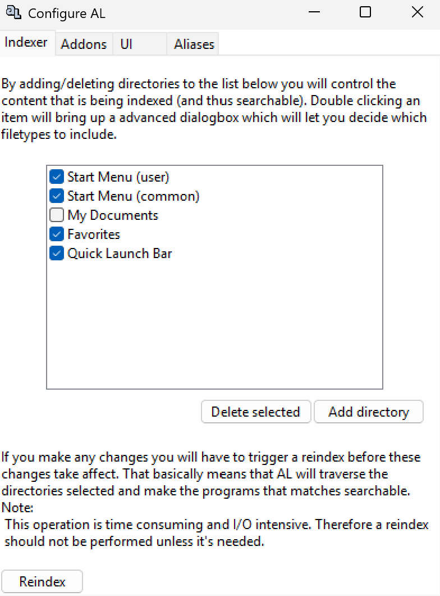
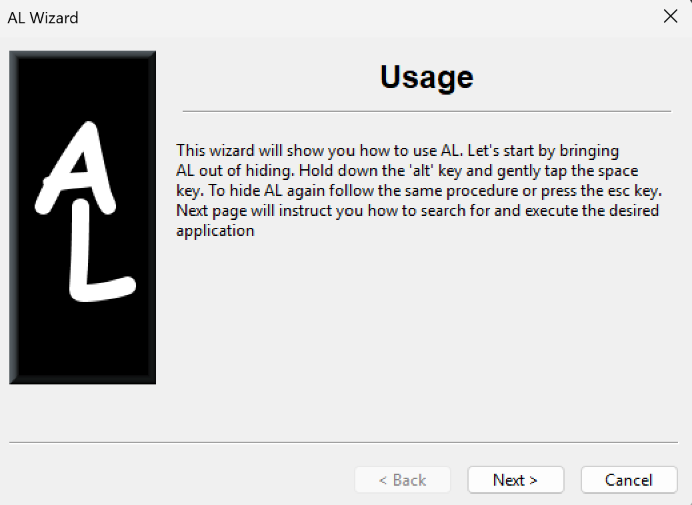

# AL - Application Launcher

AL is an application launcher. Simply put it's a tiny application that helps you to find and execute other applications faster and easier by pressing a few keys rather than manually browsing through your start menu. Check it out, it's free!

Originally created in the early 2000's, last release v1.0.7 was in 2007. This is a resurrection effort, ported to Python 3.14 and wxPython 4.x.

## Screenshots

| Main Window | Settings | Wizard |
|:-----------:|:--------:|:------:|
|  |  |  |

## Features

- **Wizard:** A wizard that enables you to learn how to use it in less than 2 minutes.
- **Zero configuration:** No configuration tweaking is needed. All programs on your start-menu, the quick launch bar and all your Favorites in both Internet Explorer and Firefox are indexed by default. Just install it and it's ready to be used.
- **AL learns:** Based on your searches and how many times a program is executed, AL is able to rank the search results so that the search experience only gets better over time. The programs you often execute will in time find their way to the top of the search results.
- **Full control:** You can easily add more folders and have full control over what AL makes searchable. AL also supports aliases which can be easily configured. Just press the cog-icon at the upper left corner to get your hands on the advanced settings.
- **External searches:** AL supports executing searches on different sites. For instance typing `g:<search term>` executes a search at google.com. See Search Plugins below for details.
- **Detailed changelog:** The changelog contains the details about the changes between each release.

## Usage

1. Hold down the `Alt` key and gently tap `Space` to bring AL out from hiding.
2. Start typing the name of the application you want to start.
3. The application displayed at the bottom left is the current suggestion. If this is not the correct one, type the full name of the application or press the `Tab` key to display more results.
4. You may use the program's initials when you perform a search. E.g. "Microsoft Office Word" can be found just by typing "mow".

## Search Plugins

AL has a few special searches that execute external searches on various sites.

| Prefix | Description | Example |
|--------|-------------|---------|
| `g:` | Google search | `g:"tore hund"` |
| `w:` | Wikipedia search | `w:tore hund` |
| `gg:` | Google Groups | `gg:"java threads"` |
| `d:` | Dictionary.com | `d:cloudberry` |
| `m:` | IMDB movie search | `m:matrix` |

### Utility Plugins

| Prefix | Description | Example |
|--------|-------------|---------|
| `mailto:` | Compose email in default mail client | `mailto:bill@microsoft.com` |
| `web:` | Open URL in default browser | `web:www.garageinnovation.org` |

## Configuration

Press the cog icon in the upper left corner of the AL application to configure it.

- You can configure which directories and files to be included.
- You can configure AL's behaviour.
- You can create aliases to different programs or actions.

## Credits

- **Developers:** Rune Devik, Kjetil Jacobsen
- **Logo & Splashscreen:** [Geekcorp Software](http://www.geekcorp.com)
- **Front Panel Icons:** [FAM FAM FAM](http://www.famfamfam.com/lab/icons/silk)
- **Testers:** Vegar, Sveinar, Jorgen, Stig Petter

## Links

- [Project on SourceForge](http://sourceforge.net/projects/launcher)
- [Website](http://www.garageinnovation.org/AL)
  - The website is all dead but can probably be viewed via the [Wayback Machine](https://web.archive.org/web/20160911230447/http://garageinnovation.org/AL/)
## License

[GNU General Public License v3](LICENSE.txt)
